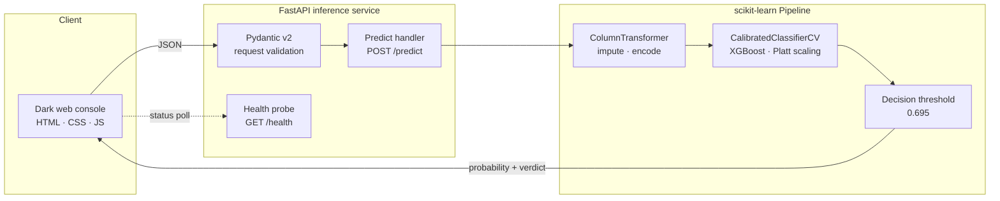
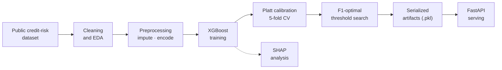

# *Credit Ledger*

*This project provides an end-to-end machine learning solution for credit risk scoring. It integrates a Platt-calibrated XGBoost classifier with an F1-optimized decision threshold, deploying the entire prediction pipeline through a fully schema-validated FastAPI application*

[](https://credit-ledger-otav.onrender.com/)
[](#model-performance)
[](LICENSE)
[](https://python.org)
[](https://fastapi.tiangolo.com)
[](https://xgboost.readthedocs.io)
[](https://scikit-learn.org)
<br/>

| ROC-AUC | Precision | Recall | F1-Score | Decision Threshold |
|:---:|:---:|:---:|:---:|:---:|
| **0.953** | **0.967** | **0.742** | **0.840** | **0.695** |

</div>

---

## Table of Contents

1. [Overview](#overview)
2. [Key Highlights](#key-highlights)
3. [Live Demo](#live-demo)
4. [Architecture](#architecture)
   - [Request Flow](#request-flow)
   - [ML Lifecycle](#ml-lifecycle)
5. [Model Performance](#model-performance)
6. [Design Decisions](#design-decisions)
7. [Tech Stack](#tech-stack)
8. [API Reference](#api-reference)
9. [Getting Started](#getting-started)
10. [Project Structure](#project-structure)
11. [Scope and Responsible Use](#scope-and-responsible-use)
12. [Author](#author)
13. [License](#license)

---

## Overview

Credit Ledger estimates an applicant's **probability of default (PD)** and converts it into an actionable risk verdict. A scikit-learn preprocessing pipeline and a Platt-calibrated XGBoost classifier ship as a single serialized artifact, are scored against an F1-optimized decision threshold, and are served through a schema-validated FastAPI service with a minimal dark-mode web console.

The repository covers the full model lifecycle: exploratory analysis, training, probability calibration, threshold selection, explainability, and a live, documented inference API.

---

## Key Highlights

- **Discrimination:** ROC-AUC of 0.953, with 0.967 precision at the tuned operating point.
- **Calibrated probabilities:** XGBoost wrapped in `CalibratedClassifierCV` (Platt scaling, 5-fold CV), so outputs behave like probabilities instead of raw boosted-tree scores.
- **Threshold optimization:** a 0.695 cutoff selected to maximize F1, replacing the default 0.5.
- **Training–serving parity:** imputation, encoding and the calibrated model sit in one scikit-learn `Pipeline`, so inference applies the same transformations learned during training.
- **Typed, self-documenting API:** Pydantic v2 validation, a `/health` probe and auto-generated OpenAPI docs at `/docs`.
- **Explainability:** SHAP `TreeExplainer` analysis in the notebook to inspect what drives predictions.
- **Resilient client:** minimal dark-mode console with a live service-status indicator and automatic retry.

---

## Live Demo

**[Launch the live app →](https://credit-ledger-otav.onrender.com/)**

Submit applicant details to receive a calibrated default probability and a risk verdict.

<!-- Add a UI screenshot or short GIF here, e.g.  -->

> The first request after a period of inactivity can take a few seconds. The console's status indicator reflects this and retries automatically.

---

## Architecture

### Request Flow



The console posts the applicant payload to `/predict`. Pydantic validates it, the `ColumnTransformer` imputes and encodes features, the calibrated model returns a probability of default, and the stored threshold turns that probability into a verdict.

### ML Lifecycle



---

## Model Performance

Trained on the public [credit risk dataset (laotse/credit-risk-dataset)](https://www.kaggle.com/datasets/laotse/credit-risk-dataset): **32,950 cleaned records and 11 features** covering applicant profile, loan terms and credit-history attributes. Evaluated on a held-out 20% split.

| Metric | Score | What it means |
|---|:---:|---|
| ROC-AUC | **0.953** | Probability that a random defaulter is ranked above a random non-defaulter |
| Precision | **0.967** | Of the cases flagged as likely defaults, 96.7% truly default |
| Recall | **0.742** | 74.2% of actual defaults are caught |
| F1-Score | **0.840** | Harmonic mean of precision and recall |
| Decision threshold | **0.695** | F1-optimal operating point on the held-out 20% split |

**Calibration.** Raw XGBoost scores were post-hoc calibrated with Platt scaling, `CalibratedClassifierCV(method="sigmoid", cv=5)`, so the service returns a usable probability of default rather than an uncalibrated score.

**Operating point.** The F1-optimal cutoff (0.695) sits above the default 0.5, so the model favors precision over recall. The threshold is stored separately in `best_threshold.pkl`, which means it can be re-tuned for a different cost trade-off without retraining the model.

---

## Design Decisions

| Decision | Why it matters |
|---|---|
| Platt-scaled probabilities | Boosted-tree scores are not inherently calibrated. Sigmoid calibration with 5-fold CV produces outputs suited to risk thresholds and downstream decision rules. |
| F1-optimized threshold, stored separately | Moves the operating point off the arbitrary 0.5 default and lets the cutoff be re-tuned to different business costs without retraining. |
| One serialized `Pipeline` | Preprocessing and model are versioned together, removing a common source of training–serving skew. |
| Pydantic v2 at the API boundary | Malformed or out-of-schema payloads are rejected with structured validation errors before they reach the model. |
| Framework-free front end | Plain HTML, CSS and JavaScript served by the same FastAPI app: no build step and nothing extra to deploy or maintain. |

---

## Tech Stack

| Layer | Technology |
|---|---|
| Language and runtime | Python 3.12 (pinned via `.python-version`) |
| API and serving | FastAPI · Uvicorn (ASGI) |
| Validation | Pydantic v2 |
| ML pipeline | scikit-learn `Pipeline` + `ColumnTransformer` |
| Model | XGBoost `XGBClassifier` + `CalibratedClassifierCV` (Platt scaling) |
| Explainability | SHAP `TreeExplainer` (notebook) |
| Front end | HTML5 · CSS3 · vanilla JavaScript |
| Hosting | Render |

---

## API Reference

| Method | Endpoint | Description |
|:---:|---|---|
| `GET` | `/` | Serves the web console |
| `POST` | `/predict` | Validates the applicant payload, scores it through the pipeline, and returns the default probability with a verdict |
| `GET` | `/health` | Liveness probe used by the console's status indicator |
| `GET` | `/docs` | Interactive OpenAPI (Swagger UI) documentation |

---

## Getting Started

**Prerequisites:** Python 3.12

```bash
git clone https://github.com/AbhishekGrover1/credit-ledger.git
cd credit-ledger

python -m venv .venv
source .venv/bin/activate        # Windows: .venv\Scripts\activate

pip install -r requirements.txt
uvicorn main:app --reload
```

The console is served at `http://localhost:8000` and the interactive API docs at `http://localhost:8000/docs`.

---

## Project Structure

```
credit-ledger/
├── main.py                   # FastAPI application and inference endpoints
├── credit_risk_model.pkl     # Serialized pipeline: ColumnTransformer + calibrated XGBoost
├── best_threshold.pkl        # F1-optimal decision threshold (float64)
├── credit_risk.ipynb         # EDA · training · SHAP analysis
├── credit_risk_dataset.csv   # Source dataset
├── requirements.txt          # Python dependencies
├── render.yaml               # Deployment blueprint (IaC)
├── .python-version           # Pinned Python runtime (3.12.3)
├── LICENSE                   # MIT
└── static/
    ├── index.html            # Web console
    ├── style.css
    └── script.js
```

---

## Scope and Responsible Use

Credit Ledger is a portfolio project built on a public dataset to demonstrate ML engineering practice. It has not been through fairness, compliance or regulatory review and should not be used for real lending decisions.

---

## Author

Built by **[Abhishek Grover](https://abhishekgroverai.netlify.app)**. Open to AI/ML engineering roles; feel free to reach out.

[Portfolio](https://abhishekgroverai.netlify.app) · [GitHub](https://github.com/AbhishekGrover1) · [LinkedIn](https://www.linkedin.com/in/abhishek-grover-07)

---

## License

Released under the [MIT License](LICENSE). © 2026 Abhishek Singh Grover.


