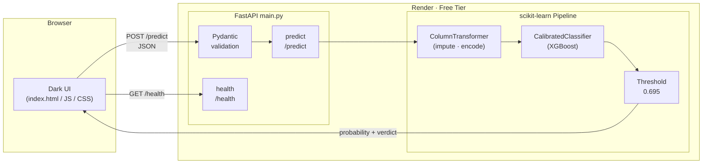

<div align="center">

```
 ┌──────────────────────────────────────────┐
 │           C R E D I T   L E D G E R     │
 └──────────────────────────────────────────┘
```

**Loan default risk scoring powered by a calibrated XGBoost pipeline.**

[](https://fastapi.tiangolo.com)
[](https://xgboost.readthedocs.io)
[](https://scikit-learn.org)
[](https://python.org)
[](https://render.com)
[](LICENSE)

</div>

---

## Architecture



---

## Stack

| Layer | Tech |
|---|---|
| API | FastAPI + Uvicorn |
| Validation | Pydantic v2 |
| ML pipeline | scikit-learn `Pipeline` + `ColumnTransformer` |
| Model | XGBoost `XGBClassifier` wrapped in `CalibratedClassifierCV` (Platt scaling) |
| Explainability | SHAP `TreeExplainer` (notebook) |
| Deployment | Render (free tier) |

---

## Model

Trained on [laotse/credit-risk-dataset](https://www.kaggle.com/datasets/laotse/credit-risk-dataset) (32 950 cleaned rows, 11 features).

| Metric | Score |
|---|---|
| ROC-AUC | 0.953 |
| Precision | 0.967 |
| Recall | 0.742 |
| F1 | 0.840 |
| Decision threshold | 0.695 (F1-optimal on held-out 20 %) |

The raw XGBoost probabilities were post-hoc calibrated with Platt scaling (`CalibratedClassifierCV(method="sigmoid", cv=5)`) so the output percentages reflect true empirical frequencies.

---

## Run locally

```bash
git clone https://github.com/AbhishekGrover1/credit-ledger
cd credit-ledger
pip install -r requirements.txt
uvicorn main:app --reload
# → http://localhost:8000
```

Interactive API docs: `http://localhost:8000/docs`

---

## Deploy to Render

1. Push the repo to GitHub.
2. In [Render](https://render.com) → **New → Blueprint** → connect the repo.
3. Render reads `render.yaml` and provisions everything automatically.

> **Note:** Free-tier instances spin down after 15 minutes of inactivity.  
> The frontend status chip shows "Waking up…" during the cold start and retries automatically.

---

## Project structure

```
credit-ledger/
├── main.py                  # FastAPI app
├── credit_risk_model.pkl    # CalibratedClassifierCV pipeline
├── best_threshold.pkl       # F1-optimal decision threshold (float64)
├── requirements.txt
├── render.yaml              # Render Blueprint
├── .python-version          # 3.12.3
├── credit_risk.ipynb        # EDA · training · SHAP analysis
├── credit_risk_dataset.csv  # Source dataset
└── static/
    ├── index.html
    ├── style.css
    └── script.js
```

---

<div align="center">

Built by **[Abhishek Grover](https://abhishekgroverai.netlify.app)**  
[GitHub](https://github.com/AbhishekGrover1) · [LinkedIn](https://www.linkedin.com/in/abhishek-grover-07)

MIT License © 2026 Abhishek Singh Grover

</div>
